Wazuh是一个用于威胁预防、检测和响应的开源平台，使用场景广泛包括但不局限于：入侵检测、日志数据分析、完整性检查、漏洞检测、配置评估、事故应变、合规、云安全、容器安全等；


**wazuh manager：**

> /var/ossec/etc/ossec.conf

**wazuh indexer：**

> /etc/wazuh-indexer/opensearch.yml

**Filebeat-OSS：**

> /etc/filebeat/filebeat.yml

**wazuh dashboard：**

> /etc/wazuh-dashboard/opensearch_dashboards.yml
>
> /usr/share/wazuh-dashboard/data/wazuh/config/wazuh.yml


/var/ossec/ruleset  # 自带规则库

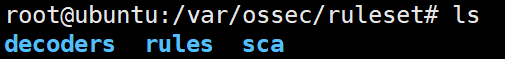

sudo vim /var/ossec/etc/ossec.conf  # 配置

> 简单的配置介绍：https://blog.csdn.net/weixin_54704770/article/details/132450063


### [Configuration assessment](https://documentation.wazuh.com/current/getting-started/use-cases/configuration-assessment.html)

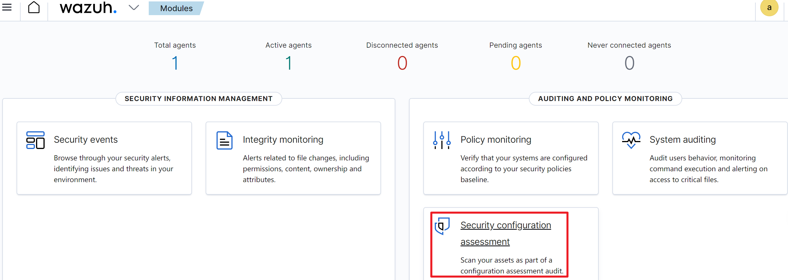


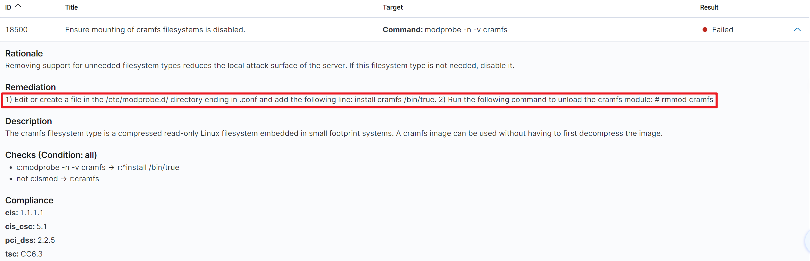

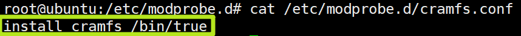

```bash
rmmod cramfs
```

重启后可发现结果转变为Passed

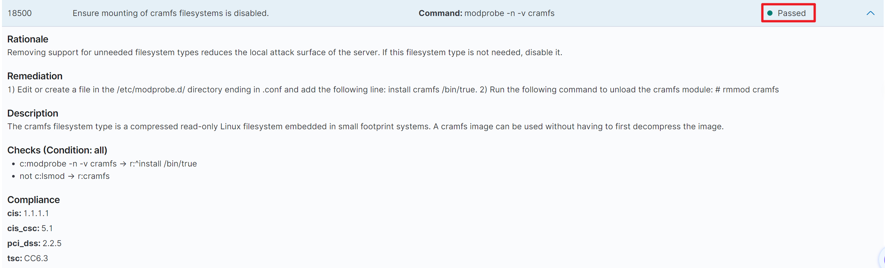

### [Malware detection](https://documentation.wazuh.com/current/getting-started/use-cases/malware-detection.html)

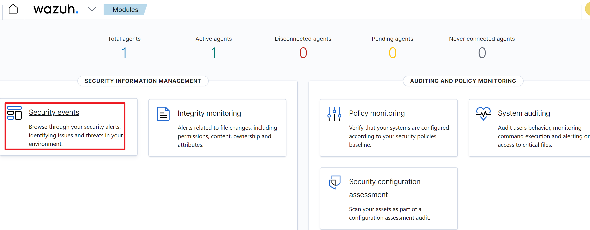

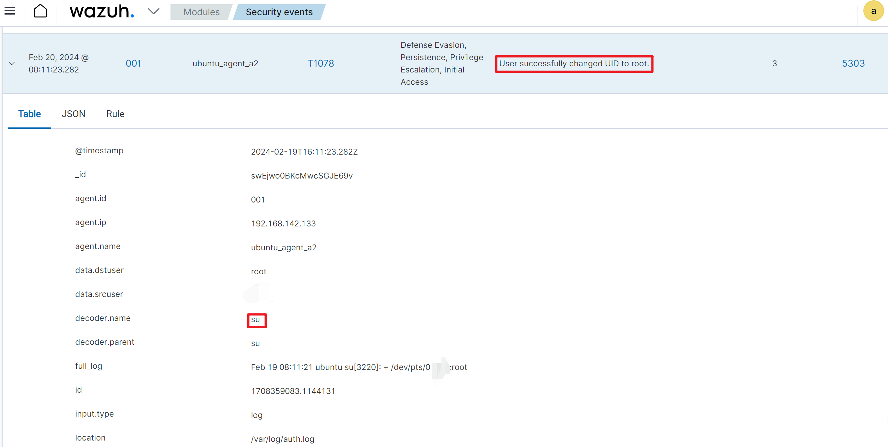

规则：

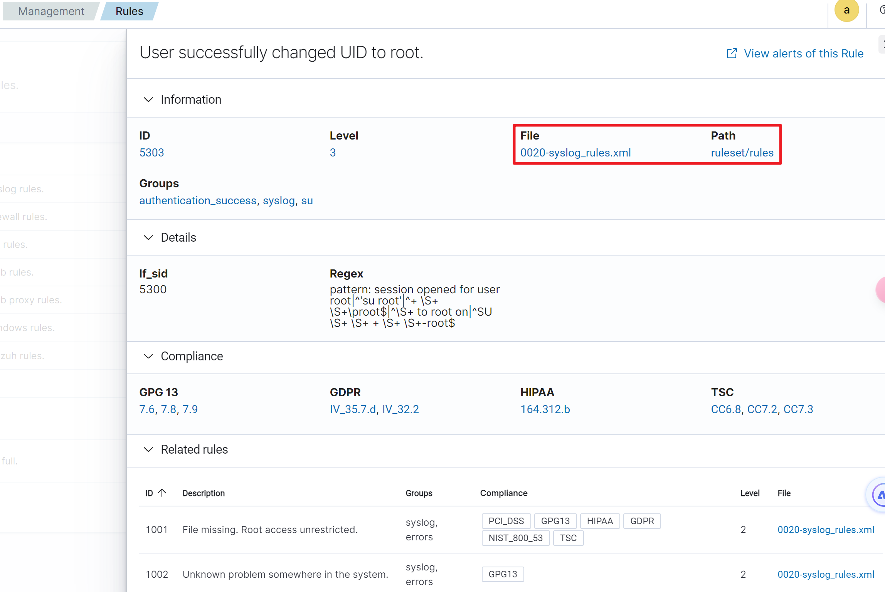

### [File integrity monitoring](https://documentation.wazuh.com/current/getting-started/use-cases/file-integrity.html)

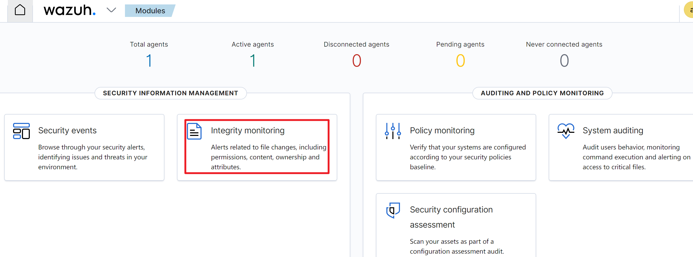

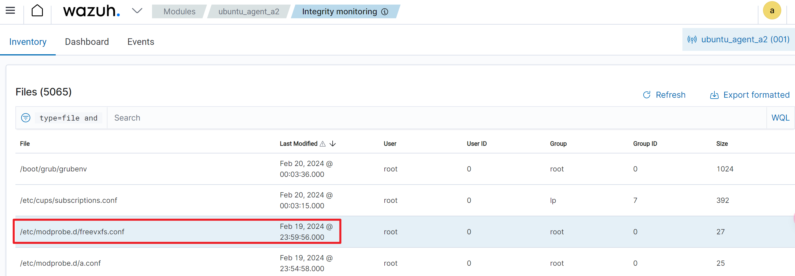

### [Threat hunting](https://documentation.wazuh.com/current/getting-started/use-cases/threat-hunting.html)

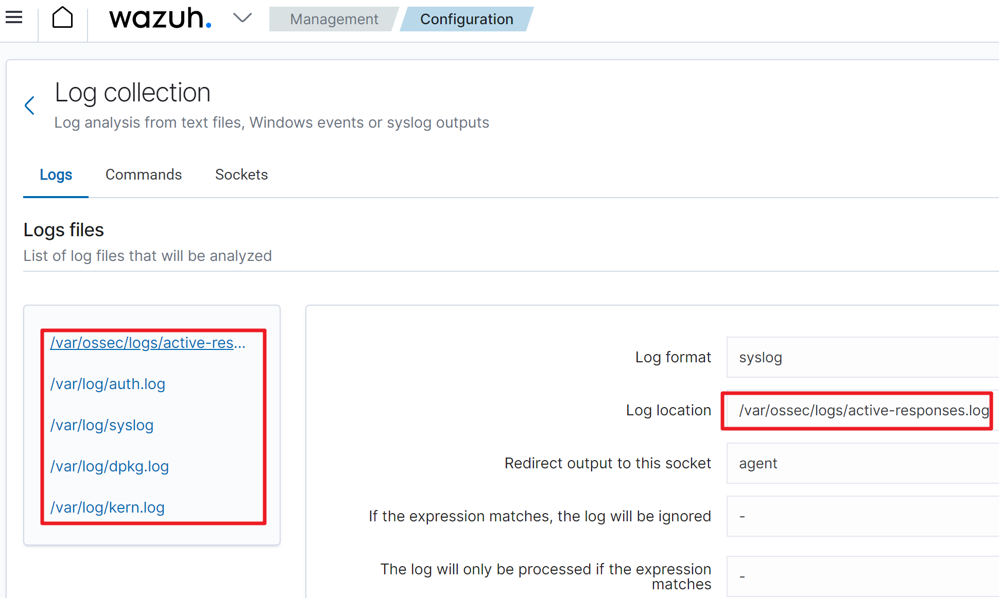


### 实际检测SQL注入的例子

> 参考：https://blog.csdn.net/weixin_53434577/article/details/132453405

安装apache

```bash
sudo apt install apache2
```

将以下行添加到wazuh-agent主机的/var/ossec/etc/ossec.conf`文件中。这允许 Wazuh 代理监控 Apache 服务器的访问日志

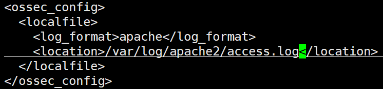

```bash
systemctl restart wazuh-agent
```

配置完成，之后模拟客户端进行注入，服务端进行检测。

使用如下命令，在攻击端进行。

```bash
curl -XGET "http://192.168.142.133/users/?id=SELECT+*+FROM+users";
```

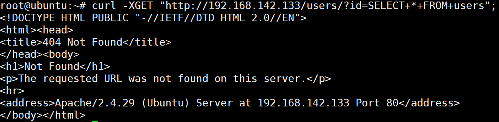

查看apache日志：

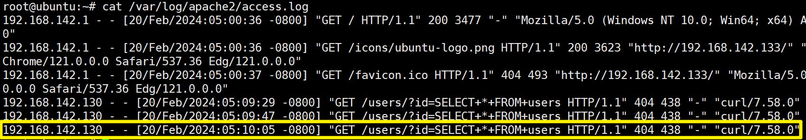

分析/var/log/apache2/access.log，可查看wazuh-server检测到SQL注入攻击：

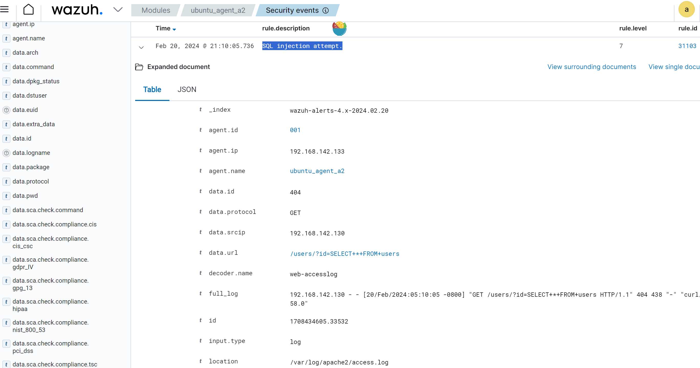


